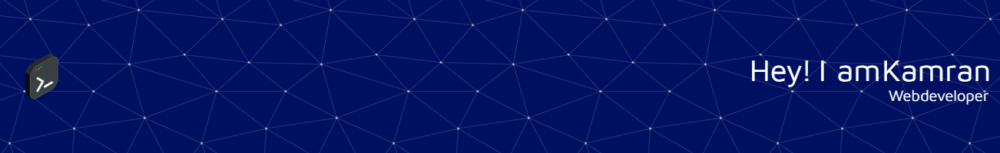

### My self-taught journey so far:

---

1. Completed HTML/CSS/JavaScript course and projects on Freecodecamp.

   - Projects included a web portfolio, resume, responsive website, and API apps to deploy on the cloud.

2. Transition from CodePen to VSCode/GitHub + Git Bash.

3. Transition from Windows 11/Shell to Linux(Ubuntu 22.04) terminal/bash.

4. Self-study with Adrian Cantrill/Stephane Maarek AWS SAA/DevOps/SysOps courses.

   - ~~Study towards AWS Solutions architect certification.~~ - Passed SAA-C03 &#10004;
   - ~~Study towards AWS Developer associate certification.~~ - Passed DVA-C02 &#10004;
   - ~~Currently studying towards AWS SysOps Administrator.~~ - Passed SOA-C02 &#10004;

5. Complete a Linux/bash scripting course by Jason Cannon.

6. Complete "More than Certified in Terraform" course by Derak Morgan.

7. Look into CompTIA Network+/CCNA and Linux Red Hat courses/certifications.

8. Study Docker/Kubernetes and CI/CD via Freecodecamp/Udemy.

9. Utilise personal web projects, including APIs, to deploy on the cloud via AWS console, CLI, and Infrastructure as Code (IaC).

10. Further cloud projects include:
    - The Cloud Resume Challenge.
    - Learn to Cloud study plan.
    - Cloud Is Free projects.

---

Please take a look at some of my projects below :arrow_down:

---

## Main technologies/languages/tools used:

  

  <a href="https://github.com/kamzie">
  
  

